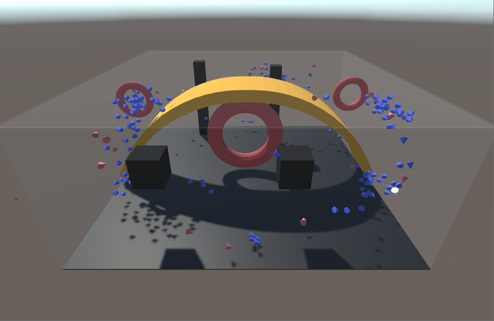
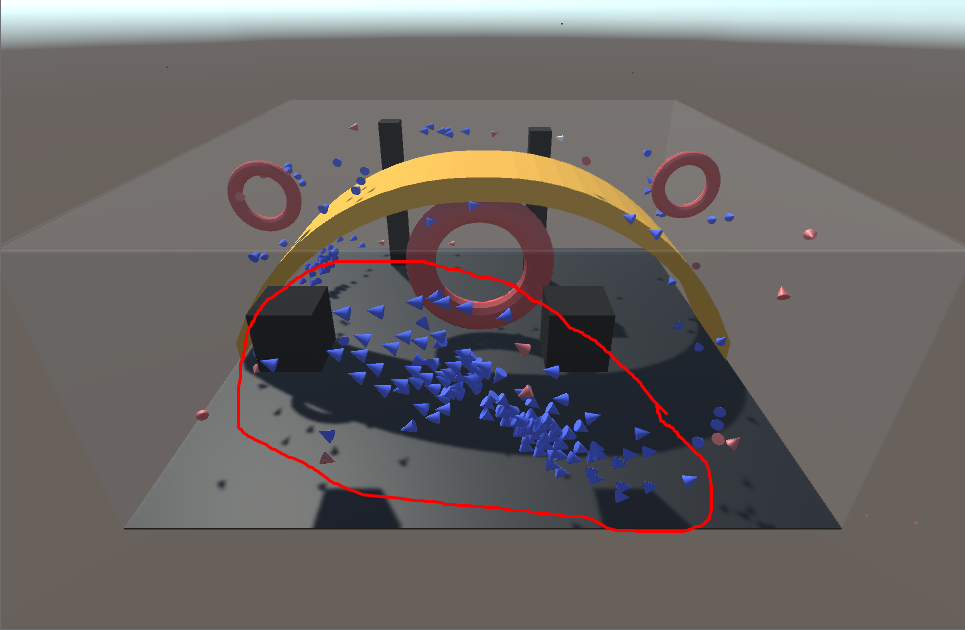

### Credits to Sebastian Lague
Hello, I hope you enjoy looking at this project. 
This started from following a fantastic youtube tutorial. 
The channel that created the tutorial is called Sebastian Lague. 
Here is a link to their video 
[Sebastian Lague's Video]: https://www.youtube.com/watch?v=bqtqltqcQhw

### What I learned
The tutorial itself taught me a lot of skills and tricks that can be used within Unity 
Not only that but I was able to implement an AI algorithm using weights and wants 

After following the tutorial I wanted to test my knowledge a little more 
I decided to create a second variation of boid. 
These boids prefer to fly alone and actively avoid other boids of the same type 
Here you can see the blue boids flying in massive flocks while the red boids are much more sparse. 

